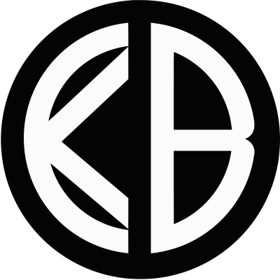
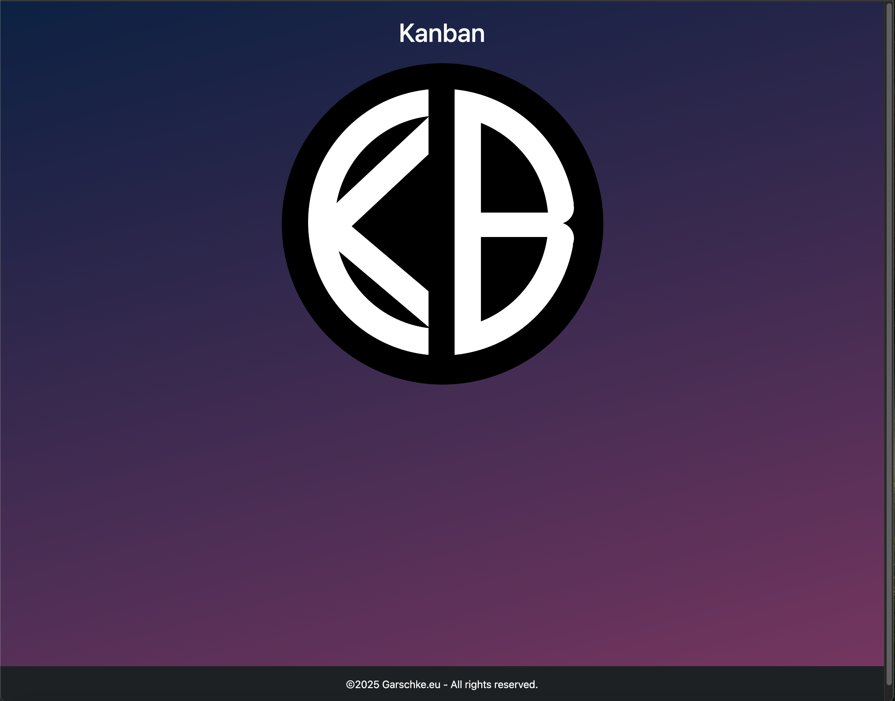

<!-- LOGO  -->


<!-- INTRODUCTION -->
# kanban-task-manager
A responsive Kanban-style task management web application built with Python (Flask) and JavaScript, HTML5 utalising Bootstrap 5.3 and custom CSS and with an SQLite DB. This project mimics core functionality from tools like Trello and Jira, featuring drag-and-drop task organization across columns.

<br>
Landing page for the KB Kanban app, clicking on logo takes you on to the main page.

<br>
<br>
The main Kanban Task Manager page where you can add and manage tasks, add descriptions for tasks and drag and drop them between the different columns for the status of the task.
<br>

#
<!-- TABLE OF CONTENTS -->
<details>
  <summary>Table of Contents</summary>
  <ol>
    <li><a href="#kanban-task-manager">Kanban Task Manager</a></li>
    <li><a href="#Features">Features</a></li>
    <li><a href="#Technology-Stack">Technology Stack</a></li>
    <li>
      <a href="#installation">Installation</a>
      <ul>
        <li><a href="#prerequisites">Prerequisites</a></li>
        <li><a href="#steps">Steps</a></li>
      </ul>
    </li>
    <li><a href="#user-guide">User Guide</a></li>
    <li><a href="#project-structure">Project Structure</a></li>
    <li><a href="#api-endpoints">API Endpoints</a></li>
    <li><a href="#customization">Customization</a></li>
    <li><a href="#troubleshooting">Troubleshooting</a></li>
    <li><a href="#future-enhancements">Future Enhancements</a></li>
    <li>
        <a href="#contributing">Contributing</a>
      <ul>
        <li><a href="#fork-the-repository">Fork the repository</a></li>
      </ul>
    </li>
    <li><a href="#license">License</a></li>
    <li><a href="#acknowledgements">Acknowledgements</a></li>
  </ol>
</details>

<!-- FEATURES -->
## Features

- Drag-and-Drop Interface:
    - Move tasks between columns (Backlog, To Do, In Progress, In Review, Done).
- Task Management:
    - Create new tasks with titles and descriptions
    - Edit existing tasks
    - Delete tasks
- Persistent Storage:
    - SQLite database stores all tasks
- Responsive Design:
    - Works on desktop and mobile devices
- Real-time Updates:
    - Changes reflect immediately without page reload

<!-- TECHNOLOGY STACK -->
## Technology Stack
Backend
- Python 3
- Flask (Web framework)
- Flask-SQLAlchemy (ORM)
- SQLite (Database)

Frontend
- HTML5
- CSS3 (with Bootstrap 5)
- JavaScript (with jQuery and jQuery UI)
- AJAX (For API communication)

<!-- INSTALLATION -->
## Installation
#### Prerequisites
* Python 3.7+ installed on your machine.
* pip package manager
* (Optional-recommended) A virtual environment for isolated dependencies.


### Steps
1. Clone this repository:

```bash
git clone https://github.com/Garschke/kanban-task-manager.git
```
2. (Optional-recommended) Create and activate a virtual environment:
```bash
python3 -m venv .venv
source .venv/bin/activate   # On Windows use: .venv\Scripts\activate
```
3. Install dependencies:
```bash
pip3 install -r requirements.txt
```

4. Run the app.py file:

```bash
python3 app.py  # Mac & Linux
python app.py   # PC
```

5. Access the application at:
```
http://localhost:5000 or http://127.0.0.1:5000
```


<!-- USERS GUIDE -->
## Users Guide

1. Click on the large TB application logo on the Landing Page to take you to the main application Kanban Task Manager page.

2. Adding Tasks:
    - Type a task title in the textarea at the bottom of any column (Enter task title - placeholder text)
    - Press Enter or click "Add Task" button

3. Editing Tasks:
    - Click on any task card
    - Modify the title or description in the modal
    - Click "Save Changes" button

4. Moving Tasks:
    - Drag and drop tasks between columns
    - The status updates automatically

5. Deleting Tasks:
    - Open the task in the edit modal
    - Click "Delete Task" button and confirm

#### 🎉  Enjoy the app, feel inspired to write and have fun!

<!-- PROJECT STRUCTURE -->
## Project Structure

```
kanban-task-manager/
├── app.py                # Flask application
├── requirements.txt      # Python dependencies
├── static/
│   ├── css/             # Stylesheets
│   ├── image/           # Images (icon, logo, screenshots)
│   └── js/              # JavaScript files
├── templates/           # HTML templates
├── instance/
│   └── tasks.db         # SQLite database (created after first run)
└── README.md            # This file
```

<!-- API ENDPOINTS -->
## API Endpoints

| Endpoint | Method | Description |
|----------|--------|-------------|
| `/api/tasks` | GET | Get all tasks |
| `/api/tasks` | POST | Create new task |
| `/api/tasks/<task_id>` | GET | Get single task |
| `/api/tasks/<task_id>` | PUT | Update task |
| `/api/tasks/<task_id>` | DELETE | Delete task |


<!-- CUSTOMIZATION -->
## Customization

You can easily customize:

1. **Columns**:
   - Modify the `kanban-column` divs in `templates/index.html`
   - Update the status options in the Task model (`app.py`)

2. **Styling**:
   - Edit `static/css/style.css`
   - Override Bootstrap variables as needed

3. **Database**:
   - Change `SQLALCHEMY_DATABASE_URI` in `app.py` to use PostgreSQL/MySQL


<!-- TROUBLESHOOTING -->
## Troubleshooting

**Issue**: Tasks not saving/updating
- Solution: Check browser console for errors and verify Flask server is running

**Issue**: Database not initializing
- Solution: Delete the `instance/tasks.db` file and restart the app

**Issue**: Drag-and-drop not working
- Solution: Ensure jQuery and jQuery UI are loading properly

<!-- FUTURE ENHANCEMENTS -->
## Future Enhancements

1. 🔲 - User authentication
2. 🔲 - Task due dates and reminders
3. 🔲 - Collaborative features (multiple users)
4. 🔲 - Task labels and filtering
5. 🔲 - Keyboard shortcuts


<!-- CONTRIBUTING -->
## Contributing
Contributions are welcome!

### Fork the repository
1. Create your feature branch: git checkout -b feature/NewFeature
2. Commit your changes: git commit -m 'Add new feature'
3. Push to the branch: git push origin feature/NewFeature
4. Open a pull request.

<!-- LICENCE -->
## License
This project is licensed under the MIT License - see the LICENSE file for details.

<!-- AKNOWLEDGEMENTS -->
## Acknowledgements

- [Bootstrap](https://getbootstrap.com/docs/5.3/getting-started/introduction/) for responsive design components
- [jQuery](https://jqueryui.com/) UI for drag-and-drop functionality
- [Flask](https://flask.palletsprojects.com/en/stable/) community for excellent documentation